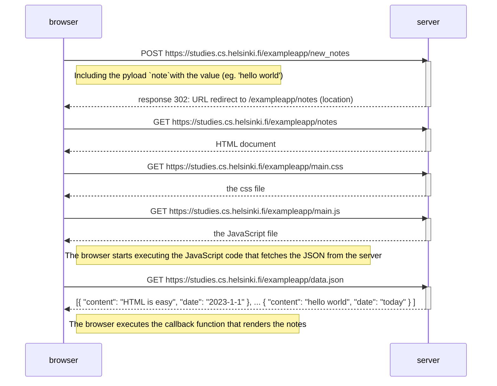

```mermaid 
sequenceDiagram
participant browser
participant server

browser->>server: POST https://studies.cs.helsinki.fi/exampleapp/new_notes
activate server
Note right of  browser: Including the pyload `note`with the value (eg. 'hello world')
server-->>browser: response 302: URL redirect to /exampleapp/notes (location)
deactivate server

browser->>server: GET https://studies.cs.helsinki.fi/exampleapp/notes
    activate server
    server-->>browser: HTML document
    deactivate server

browser->>server: GET https://studies.cs.helsinki.fi/exampleapp/main.css
activate server
server-->>browser: the css file
deactivate server

browser->>server: GET https://studies.cs.helsinki.fi/exampleapp/main.js
activate server
server-->>browser: the JavaScript file
deactivate server

Note right of browser: The browser starts executing the JavaScript code that fetches the JSON from the server

browser->>server: GET https://studies.cs.helsinki.fi/exampleapp/data.json
activate server
server-->>browser: [{ "content": "HTML is easy", "date": "2023-1-1" }, ... { "content": "hello world", "date": "today" } ]
deactivate server

Note right of browser: The browser executes the callback function that renders the notes
```

