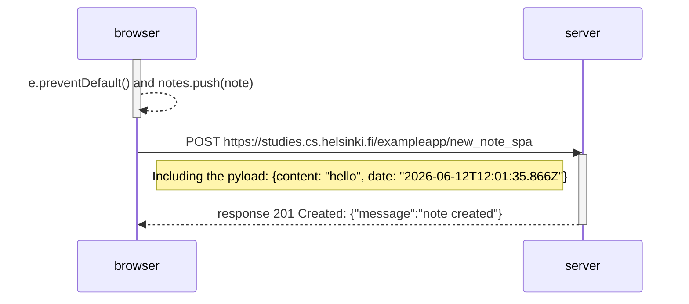

```mermaid 
sequenceDiagram
participant browser
participant server

activate browser
browser-->>browser: e.preventDefault() and notes.push(note)
deactivate browser
browser->>server: POST https://studies.cs.helsinki.fi/exampleapp/new_note_spa
activate server
Note right of  browser: Including the pyload: {content: "hello", date: "2026-06-12T12:01:35.866Z"}
server-->>browser: response 201 Created: {"message":"note created"}
deactivate server


```

